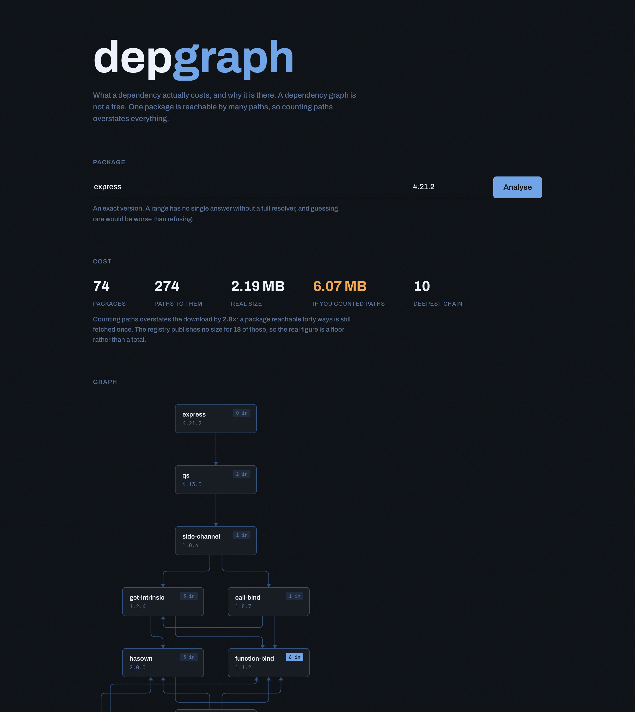
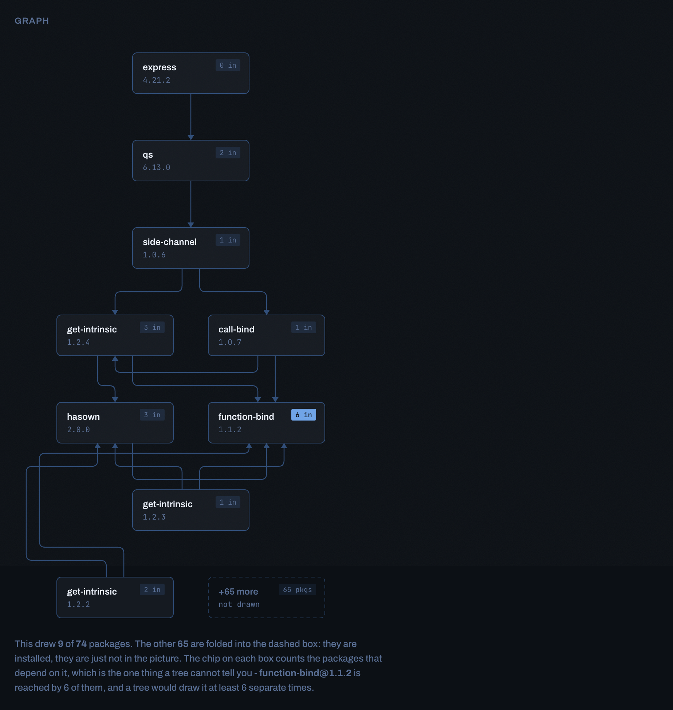

# depgraph

What a dependency actually costs, and why it is there.



Those are real numbers for `express@4.21.2`: **72 packages reached by 232 paths**, 2.11 MB of
actual download against 5.03 MB if you counted every path, and `get-intrinsic` resolving to
**four different versions at once**.

## The idea

A dependency graph is not a tree. One package version is reachable by many routes, so it is
stored once and the routes are derived by walking edges. Store a row per path instead and the
same package appears thousands of times over on a real project, which makes "how big is this
actually" unanswerable.

That is the whole design, and every number here follows from it:

- **Real size** deduplicates. **Naive size** sums paths. The gap is what most size tools report.
- **Licences** count packages, not paths, so a shared dependency does not inflate an audit.
- **Why is it here** is the shortest route from your package to that one - the question a
  lockfile cannot answer.

## The walk

Every query is one recursive CTE in Postgres. Pulling the graph into Python to answer a
question about three rows of it would be the wrong place to do the work.

```sql
WITH RECURSIVE walk AS (
    SELECT pv.id, 0 AS depth, ARRAY[pv.id] AS path
      FROM package_version pv
     WHERE pv.name = :name AND pv.version = :version
    UNION ALL
    SELECT c.id, w.depth + 1, w.path || c.id
      FROM walk w
      JOIN edge e ON e.parent_id = w.id
      JOIN package_version c ON c.id = e.child_id
     WHERE NOT c.id = ANY(w.path)      -- the load-bearing line
       AND w.depth < :max_depth
)
```

**That cycle guard is not defensive coding.** npm's graph is supposed to be acyclic and is
not - circular dependencies are legal and common. Without the guard the query does not return
a wrong answer, it never returns at all. `path` doubles as the guard and as the answer to
"why is this here".

## The graph

It is called depgraph and for a while it drew no graph.



Nine boxes out of seventy-four, and the reduction is the feature rather than a limit.
Drawing all seventy-four produces a hairball whose only message is "a lot".

Two rules do the choosing:

- **A package is ranked by its shallowest depth.** Something reachable at depth 1 and again
  at depth 5 is a direct dependency that also happens to be reached the long way round, and
  filing it at 5 would misdescribe the shape.
- **Pick the convergence, then the packages that converge on it.** Taking the highest fan-in
  node in each rank independently gave ten boxes and three edges, because those nodes mostly
  do not depend on each other. Ten unconnected boxes is a list.

**The chip on each box is the whole point.** It counts the packages that depend on that one,
and it is the only thing a graph shows that a tree cannot: `function-bind@1.1.2` is reached
by six, so a tree would draw it six separate times and you would never see that they were
the same box.

Whatever does not fit is folded into one dashed node carrying its count, and the caption
says how many were drawn out of how many exist. A small picture must not be mistakable for
a small graph.

Connectors are right-angle elbows with rounded corners, and every horizontal run sits in
the gap between two rank rows, never at a node's own y. That single invariant is why a
connector can never be drawn across a box.

## Honesty about what it does not know

- **A range is refused, not guessed.** `^4.0.0` needs a real resolver to become a version.
  This takes the floor of a range when crawling and says so; the API returns 422 for anything
  it cannot resolve rather than inventing a lockfile.
- **The registry publishes no size for some packages.** Those are counted and reported, and
  the total is labelled a floor rather than a total. For `express` that is 19 of 72.
- **A package the registry refused stays unresolved** rather than being recorded as having no
  dependencies, because those two look identical and mean opposite things.

## Two surfaces, and why there are two

There is a REST API and a GraphQL one at `/graphql`, over one `queries.py`. A second API is
normally how a codebase acquires two implementations of one thing that drift until nobody
knows which is right, so it needs an argument rather than a fashion.

**GraphQL makes `null` ambiguous, and refusing that ambiguity is what this service is for.**
The rule above says a package the registry refused must not read as a package with no
dependencies. Over REST that survives as `resolved`, `unknown_size`, `size_is_partial` and a
422. In an ordinary GraphQL schema all of it collapses into a nullable `Int`, and the caller
cannot tell "there is none" from "we could not find out".

So no nullable scalar in the schema is allowed to carry a failure:

| Situation | What comes back |
| --- | --- |
| a range that cannot be resolved | `UnresolvableVersion`, inside `data`, with the words the 422 uses |
| a package nobody has crawled | `NotCrawled`, not an empty dependency list |
| a size nobody published | `Size.isFloor` with a count of what is missing, never a bare number |
| a package with no licence field | `null`, because npm permits that. An absence, not a failure |

That last row is the only nullable scalar in the schema, and the distinction it holds is the
whole point of the other three.

**Nesting is free, and that is measured rather than promised.** `queries.tree` answers the
whole reachable set in one recursive CTE, so the root resolver runs it once and every field
below reads from memory. `dependencies { dependencies { dependencies } }` costs no additional
query at any depth, and `test_statement_count.py` fails if that stops being true.

A DataLoader was the obvious alternative and is deliberately not here. A loader batches N+1
down to a few round trips; there is one round trip already, because the data layer was
written to answer the whole question in SQL rather than a node at a time. Adding a loader
would be adding a mechanism for a problem this schema does not have. A future
`packages(specs: [...])` field taking several roots at once is when one would earn its place.

## Run it

```bash
docker compose up -d --wait          # postgres
cd api && uv sync && uv run uvicorn depgraph.app:app --port 8100
cd web && npm install && npm run dev
```

`http://127.0.0.1:8100/graphql` serves the schema and an explorer:

```graphql
{
  package(name: "express", version: "4.18.2") {
    ... on Package {
      size { bytes isFloor unknownPackages }
      dependencies { spec dependencies { spec } }
      why(target: "ms")
    }
    ... on NotCrawled { suggestion }
  }
}
```

## Tests

```bash
cd api && uv run pytest
```

Fifty tests against **real Postgres**, not a stand-in. An in-memory SQLite would not
exercise a recursive CTE the same way and has no array containment, so the cycle guard would
go untested - testing the fake would prove nothing.

The two that matter most are `test_a_cycle_terminates` and `test_self_dependency_terminates`.
Both would hang forever without the guard, which is a far worse failure than a wrong number.

One test exists because of a bug found by running it on real data: `unknown_size` counted
**paths** while every other figure counted distinct packages, reporting 53 of 232 where the
truth was 19 of 72 - inflating its own caveat by 2.8×.

Two of the suites are guards on the GraphQL surface rather than tests of it.
`test_statement_count.py` holds the claim that nesting is free, and
`test_surfaces_agree.py` asserts that each REST endpoint and its GraphQL equivalent give the
same answer, so drift between the two is a failing test rather than something to notice in
review.

Both were checked by breaking the code on purpose, and both had something wrong with them the
first time. The list is in [`docs/mutations.md`](docs/mutations.md), along with the two
failures that found: a growth test that was vacuous in a way that read as thorough, and a
guard whose one gap was exactly the field most able to drift.

## Stack

FastAPI · Strawberry GraphQL · SQLAlchemy 2 · PostgreSQL 17 · httpx · React · TypeScript · Vite

Data comes from `registry.npmjs.org`, which needs no key and no account.

MIT © James Kim
